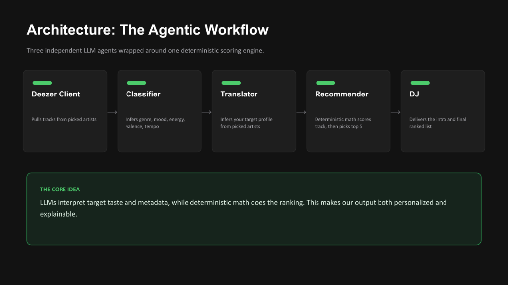
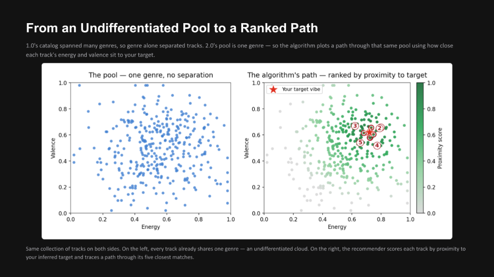
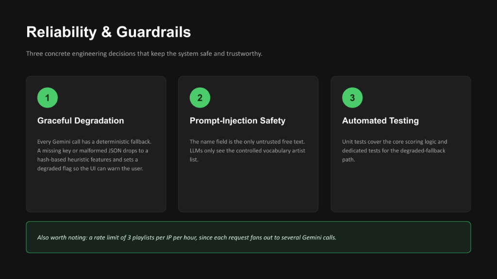

# VibeFinder 2.0: The AI DJ & Dynamic Profiler

[](https://github.com/Of-Arte/VibeFinder2.0/actions/workflows/tests.yml)


> VibeFinder 1.0 was a static CLI music recommendation engine that connected a user's personal taste profile with matching songs from a hardcoded CSV catalog. It calculated numeric scores based on genre, mood, energy level, acoustic attributes, and valence to return a ranked list of suggestions.

**VibeFinder 2.0** evolves the CLI tool into a React frontend where users pick their favorite artists in a curated onboarding flow. The FastAPI backend leverages the **Deezer API** to fetch similar tracks, uses **Gemini** to classify those and generate a personalized intro and the mathematically ranked playlist.

## Architecture Overview

The system relies on an **Agentic Workflow** composed of three distinct LLM agents wrapped around a deterministic mathematical scoring engine.



*(See [assets/diagrams/architecture.mmd](assets/diagrams/architecture.mmd) for the full visual flow and [ai_interactions.md](ai_interactions.md) for step-by-step intermediate reasoning traces).*

### Recommendation Algorithm

To rank tracks from the fetched artist catalog, the recommender calculates proximity scores in a multi-dimensional feature space (matching energy and valence against the target vibe).



## UI / UX — The User Flow

<table>
  <tr>
    <th align="center">① Splash</th>
    <th align="center">② Pick Artists</th>
    <th align="center">③ Playlist + DJ Intro</th>
  </tr>
  <tr>
    <td align="center"></td>
    <td align="center"></td>
    <td align="center"></td>
  </tr>
</table>

> See [`assets/mockups/`](assets/mockups/) for all viewport variants and screen renders.

## Setup Instructions

### Option 1: Docker (Fastest Setup)
Ensure Docker is installed and running, then:
1. Create a `.env` file in the root directory:
   ```text
   GEMINI_API_KEY=your_gemini_api_key
   ```
2. Build and start the application in one command:
   ```bash
   docker compose up --build
   ```
3. Open `http://localhost:5173` in your browser.

### Option 2: Manual Setup (Local Development)
1. **Configure Environment Variables**:
   Create a `.env` file in the project root:
   ```text
   GEMINI_API_KEY=your_gemini_api_key
   ```

2. **Install Dependencies & Start Backend**:
   Run the following from the project root:
   ```bash
   python -m venv .venv
   # Activate: source .venv/bin/activate (macOS/Linux) or .venv\Scripts\activate (Windows)
   pip install -r requirements.txt
   python -m uvicorn backend.server:app --reload --port 8000
   ```

3. **Install Dependencies & Start Frontend**:
   In a new terminal window, run the following:
   ```bash
   cd frontend && npm install && npm run dev
   ```
4. Open `http://localhost:5173` in your browser.

## Sample Interactions (Execution Evidence)

Captured from `POST /api/recommend`.

### Example 1: High Energy EDM

<details>
<summary><code>View API Request</code></summary>

```json
{
  "user_name": "Alex",
  "selected_artists": ["Daft Punk", "Justice", "The Weeknd"]
}
```

</details>

<details>
<summary><code>View API Response (200 OK)</code></summary>

```json
{
  "user_name": "Alex",
  "source": "deezer",
  "target_vibe": {
    "favorite_genre": "edm",
    "favorite_mood": "intense",
    "target_energy": 0.85,
    "likes_acoustic": false
  },
  "dj_intro": "If you've been craving that heavy French touch and neon-soaked groove, I see you. Stay locked right here because we're diving straight into the dark, pulsating world of \"World Away\" with the Marie Davidson Remix.",
  "playlist": [
    {
      "title": "World Away (Marie Davidson Remix)",
      "artist": "Etienne de Crécy",
      "genre": "edm",
      "mood": "intense",
      "energy": 0.85,
      "tempo_bpm": 125.0,
      "valence": 0.45,
      "danceability": 0.7,
      "acousticness": 0.04,
      "cover_url": "https://cdn-images.dzcdn.net/images/cover/8adff8867bde078c...",
      "preview_url": "https://cdnt-preview.dzcdn.net/api/1/1/f/d/f/0/fdf1bafbdeb...",
      "score": 8.44,
      "reasons": [
        "Exact genre match (+3.0)",
        "Mood match (+2.0)",
        "Energy proximity (100% match, +2.00)",
        "Produced/Electronic match (+1.44)"
      ]
    }
    // ... 4 more tracks
  ]
}
```

</details>

### Example 2: Chill Acoustic

<details>
<summary><code>View API Request</code></summary>

```json
{
  "user_name": "Sarah",
  "selected_artists": ["Fleet Foxes", "Bob Marley", "Taylor Swift"]
}
```

</details>

<details>
<summary><code>View API Response (200 OK)</code></summary>

```json
{
  "user_name": "Sarah",
  "source": "deezer",
  "target_vibe": {
    "favorite_genre": "folk",
    "favorite_mood": "chill",
    "target_energy": 0.5,
    "likes_acoustic": true
  },
  "dj_intro": "From the soaring harmonies of Fleet Foxes and the timeless grooves of Bob Marley to the brilliant storytelling of Taylor Swift, your taste spans generations. Now, get ready to feel inspired as you listen to José González and 'Stay Alive' right here on your airwaves.",
  "playlist": [
    {
      "title": "Stay Alive (From \"The Secret Life of Walter Mitty\" Soundtrack)",
      "artist": "José González",
      "genre": "folk",
      "mood": "chill",
      "energy": 0.48,
      "tempo_bpm": 118.0,
      "valence": 0.52,
      "danceability": 0.58,
      "acousticness": 0.85,
      "cover_url": "https://cdn-images.dzcdn.net/images/cover/3e8f8b9ff3d770fd...",
      "preview_url": "https://cdnt-preview.dzcdn.net/api/1/1/7/f/9/0/7f9fea3d3ab...",
      "score": 8.23,
      "reasons": [
        "Exact genre match (+3.0)",
        "Mood match (+2.0)",
        "Energy proximity (98% match, +1.96)",
        "Acoustic match (+1.27)"
      ]
    }
  ]
}
```

</details>

## Reliability & Guardrails

We implement three concrete engineering decisions to keep the system safe, predictable, and trustworthy:



1. **Graceful Degradation**: Every Gemini call has a deterministic fallback. A missing key or malformed JSON drops to a hash-based heuristic features and sets a degraded flag so the UI can warn the user.
2. **Prompt-Injection Safety**: The name field is the only untrusted free text. LLMs only see the controlled vocabulary artist list.
3. **Automated Testing**: Unit tests cover the core scoring logic and dedicated tests for the degraded-fallback path.

> [!NOTE]
> We enforce a rate limit of 3 playlists per IP per hour to prevent Gemini API quota abuse.

## Design & API Decisions
- **Batched Classification**: To avoid hitting rate limits while using Gemini API for the classification task, we bundle the tracks into a single JSON array payload.
- **Artist Selection**: By restricting the user to selecting from a curated list of 16 real-world artists, we prevent edge-case hallucinations and ensure the translator always has solid context to work from.
- **API Reliability**: The Deezer API requires no authentication keys, making the system immediately reproducible for anyone cloning the repository without additional credential setup.

## Reflection
This project made me realize the complexities of combining deterministic algorithms with non-deterministic LLMs. I learned that rate limits are a major constraint, forcing creative architecture and engineering solutions. I saw how LLM's can be used to create a more personalized user experience, but can also introduce new challenges like hallucination and bias. Using deterministic techniques and guardrails can help mitigate these risks. 

*(See [model_card.md](model_card.md) for a deeper reflection on AI, ethics, and model biases).*

## Documentation and References
This project utilizes the following third-party libraries, tools, and APIs.

### Project Documentation
* **[AI Interactions Log](ai_interactions.md)** - Reasoning traces and sample LLM conversations.
* **[Model Card & Ethical Reflection](model_card.md)** - Model details, evaluation metrics, and reflection on AI ethics.


### APIs
* **[Deezer API Documentation](https://developers.deezer.com/api)** - Music metadata retrieval and 30-second audio previews.
* **[Google Gemini API](https://ai.google.dev/gemini-api/docs)** - Used for batched track classification, vibe translation, and natural language DJ intros.

### Backend
* **[FastAPI](https://fastapi.tiangolo.com/)** - Python web framework for building APIs.
* **[Uvicorn](https://www.uvicorn.org/)** - Server implementation for running FastAPI.
* **[Pytest](https://docs.pytest.org/)** - Python testing framework.

### Frontend
* **[React](https://react.dev/)** - JS library for building user interfaces.
* **[Vite](https://vite.dev/)** - Build tool and dev server for frontend.
* **[Oxlint](https://github.com/oxc-project/oxc)** - JS/TS linter.
