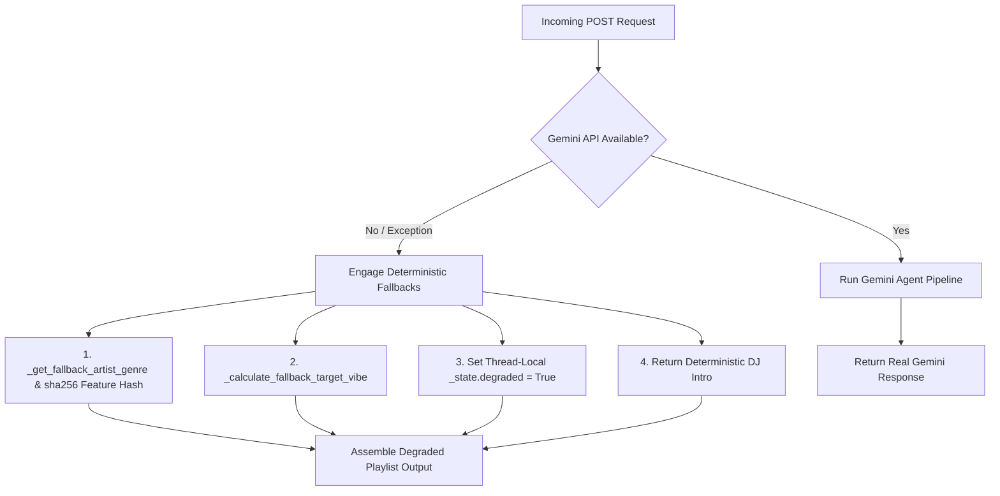

# AI Interactions & Agent Reasoning 

This document records the reasoning traces, outputs, and execution flow for VibeFinder 2.0.
---

## Scenario 1: Acoustic / Chill Folk Profile

1. **Agent 1 (Vibe Translator)**:
   - Input: `["Fleet Foxes", "Bob Marley", "Taylor Swift"]`
   - Output:
     ```json
     {
       "favorite_genre": "folk",
       "favorite_mood": "chill",
       "target_energy": 0.45,
       "likes_acoustic": true,
       "target_valence": 0.60,
       "target_danceability": 0.55,
       "target_acousticness": 0.82,
       "target_tempo_bpm": 105.0
     }
     ```

2. **Agent 2 (Batched Classifier Output)**:
   - Output: {"genre": "folk", "mood": "chill", "energy": 0.48, "acousticness": 0.85, "valence": 0.52, "tempo_bpm": 118, "danceability": 0.58}

3. **Deterministic Recommender Output**:
   - Output: "Stay Alive (Score = 8.23, reasons: Exact genre match +3.0, Mood match +2.0, Energy proximity +1.96, Acoustic match +1.27)"

4. **Agent 3 (DJ Intro Generator Output)**:
   - Output: "From the soaring harmonies of Fleet Foxes and the timeless grooves of Bob Marley to the storytelling of Taylor Swift, your taste spans generations. Get ready to unwind as we start off with José González and 'Stay Alive'."

---

## Scenario 2: Fallback Path Execution Trace

When the Gemini API key is unavailable (`config.GEMINI_API_KEY` missing or invalid) or rate limits (429 HTTP status) trigger, the system automatically engages deterministic fallbacks without failing requests.



## Fallback Path Trace

1. **Degraded Vibe Translation**:
   `_calculate_fallback_target_vibe` computes exact averages across Deezer candidate track features matching selected artist names.
   - Resulting Target Vibe: `{"favorite_genre": "pop", "favorite_mood": "happy", "target_energy": 0.60, "likes_acoustic": false, ...}`

2. **Degraded Track Classification (`_fallback_classification`)**:
   Uses hashing of `artist|title` to map continuous attributes uniformly between $[0.0, 1.0]$, preventing feature collapse:
3. **Degraded Flag Header**:
   The response payload includes `"degraded": true`, triggering a notification banner in the frontend UI informing the user that fallback heuristic scoring was used.
