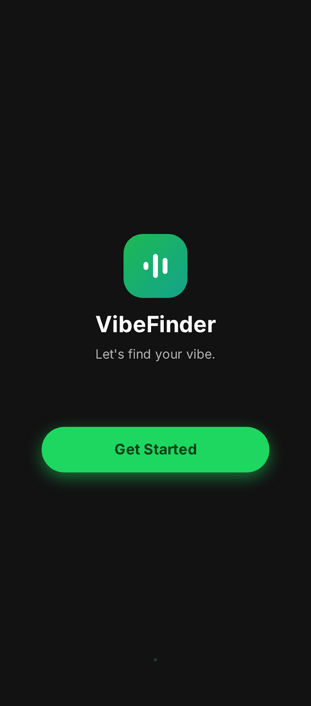
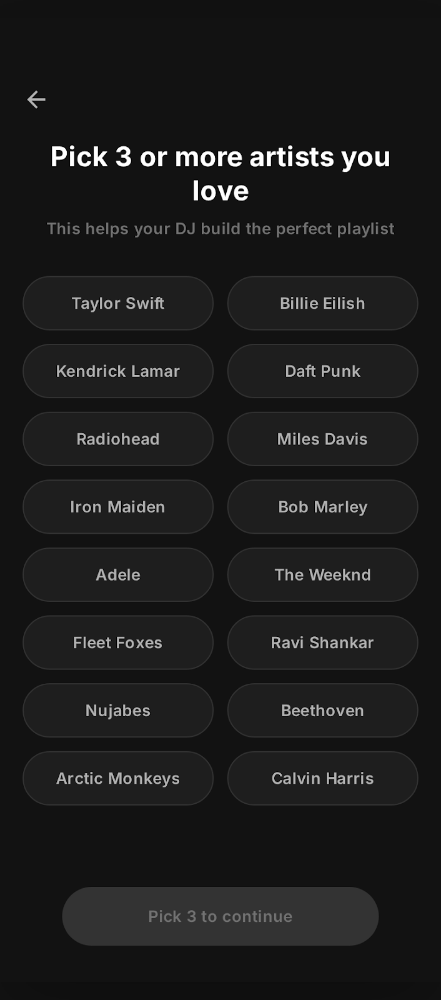

# VibeFinder UI/UX Design System & Mockup Catalog

This directory contains the original UI design specifications, interactive mockups, and screen renders for **VibeFinder 2.0**.

---

## 1. Directory Hierarchy & User Flow Architecture

The mockups are organized directly under this directory, covering both mobile and desktop viewports alongside state variations (initial, active/selected, pressed, detail modal).

```
assets/mockups/
├── README.md                          <- Master Visual Catalog & Design Tokens
├── onboarding-desktop.png             <- Desktop Taste Input (5 selected)
├── onboarding-mobile-initial.png      <- Mobile Taste Input (Initial State)
├── onboarding-mobile-selected.png     <- Mobile Taste Input (Selected State)
├── results-desktop.png                <- Desktop Recommendations
├── results-mobile-modal.png           <- Mobile Track Details Modal
├── results-mobile.png                 <- Mobile Recommendations
├── splash-desktop.png                 <- Desktop Landing Screen
├── splash-mobile-pressed.png          <- Mobile Landing Screen (Pressed CTA State)
└── splash-mobile.png                  <- Mobile Landing Screen (Default)
```

---

## 2. Visual Catalog & Screen Reference

| Flow Stage | Viewport | State / Variant | Screen Preview |
| :--- | :--- | :--- | :--- |
| **Splash Screen** | Mobile | Default / Hero |  |
| **Splash Screen** | Mobile | Pressed CTA State |  |
| **Splash Screen** | Desktop | Widescreen Hero |  |
| **Artist Selection** | Mobile | Initial (Unselected) |  |
| **Artist Selection** | Mobile | Active Selection |  |
| **Artist Selection** | Desktop | 5 Artists Selected |  |
| **Playlist Results** | Mobile | Results & DJ Card |  |
| **Playlist Results** | Mobile | Track Info Modal |  |
| **Playlist Results** | Desktop | Widescreen Results |  |

---

## 3. Design System Tokens & Style Guide

These mockups establish the core design language used across the React frontend (`frontend/src/index.css`).

### Color Palette

| Token Name | Hex Code | Purpose / Usage |
| :--- | :--- | :--- |
| `--bg-primary` | `#121212` | Deep matte black main container background |
| `--bg-surface` | `#1E1E1E` | Card surface & secondary container background |
| `--bg-surface-hover` | `#282828` | Interactive surface hover & disabled button state |
| `--accent-green` | `#1DB954` | Primary brand accent, active CTAs, badges |
| `--accent-green-bright` | `#53E076` | Glow highlights & active selection borders |
| `--text-primary` | `#FFFFFF` | Primary headings, track titles, key action labels |
| `--text-secondary` | `#B3B3B3` | Subtitles, artist names, metadata, secondary body |

### Typography & Geometry
- **Primary Font**: `Inter`, system-ui, sans-serif
- **Heading Weight**: `700` / `800` (Bold/ExtraBold with `-0.01em` letter spacing)
- **Border Radius**:
  - Cards & Modals: `24px` (`--radius-card`)
  - Pill Buttons & Badges: `9999px` (`--radius-pill`)
- **Glow & Shadow**: `0 4px 12px rgba(29, 185, 84, 0.3)` (`--cta-glow`)
