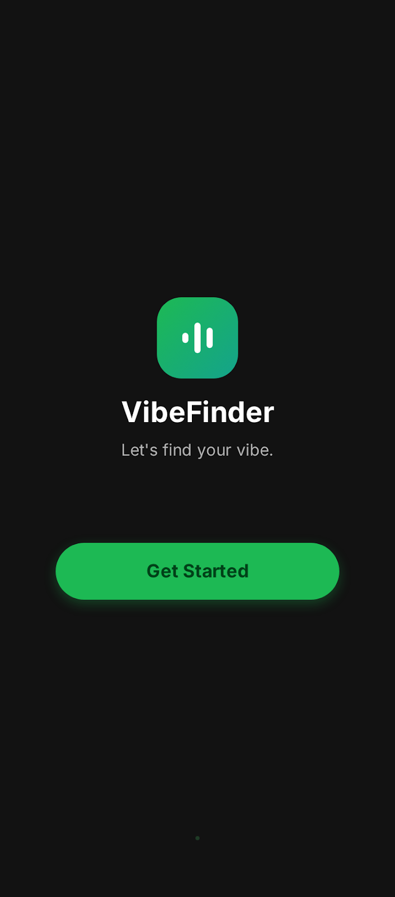
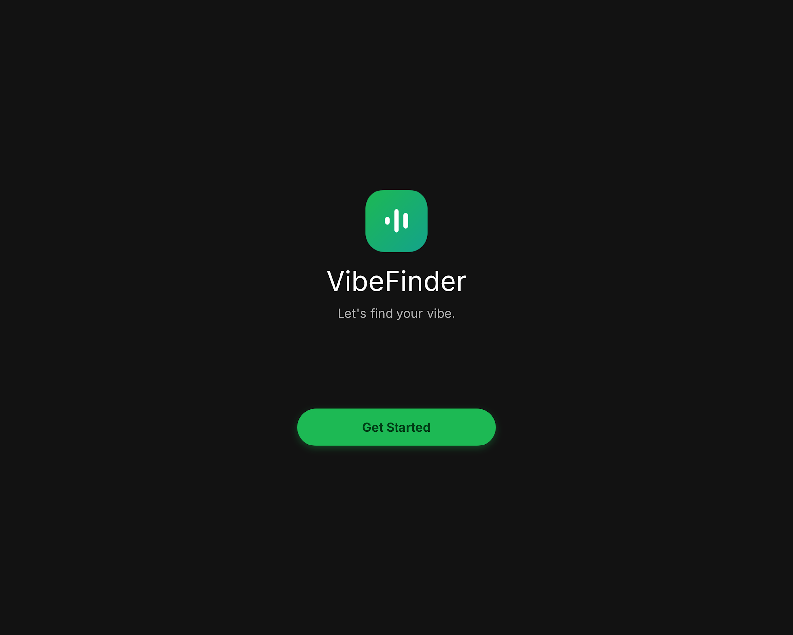
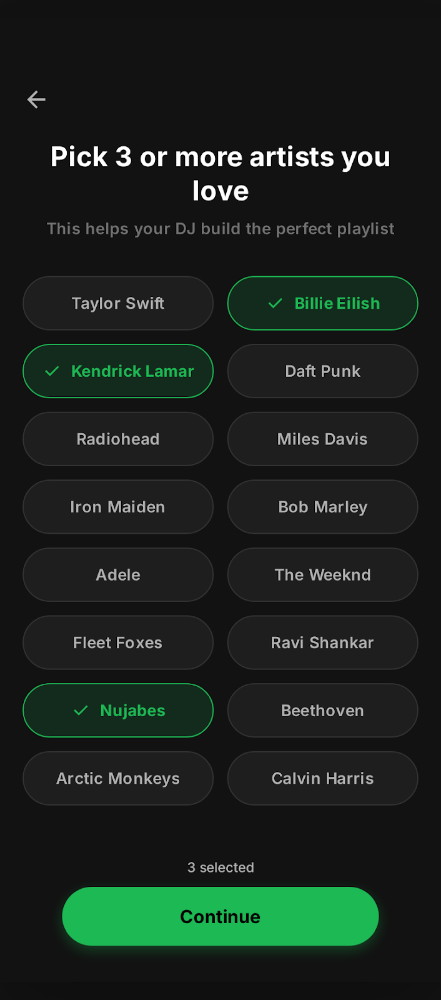
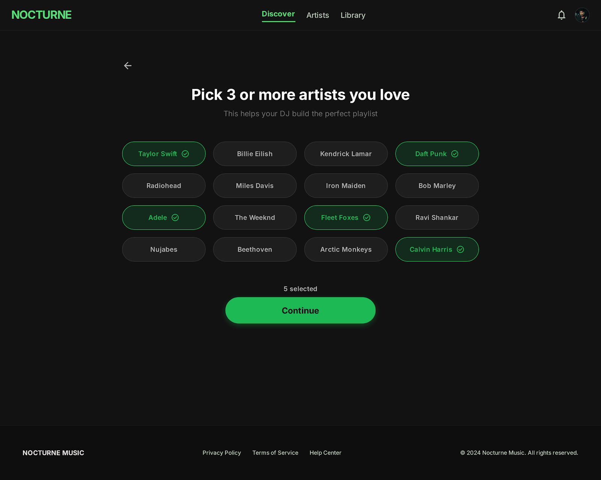
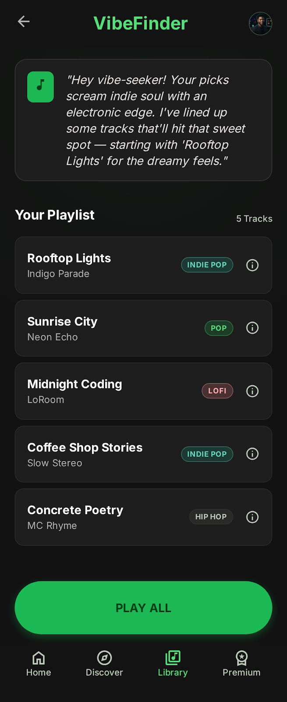
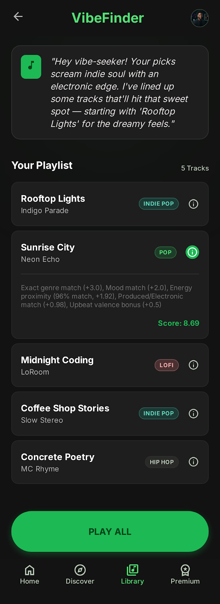
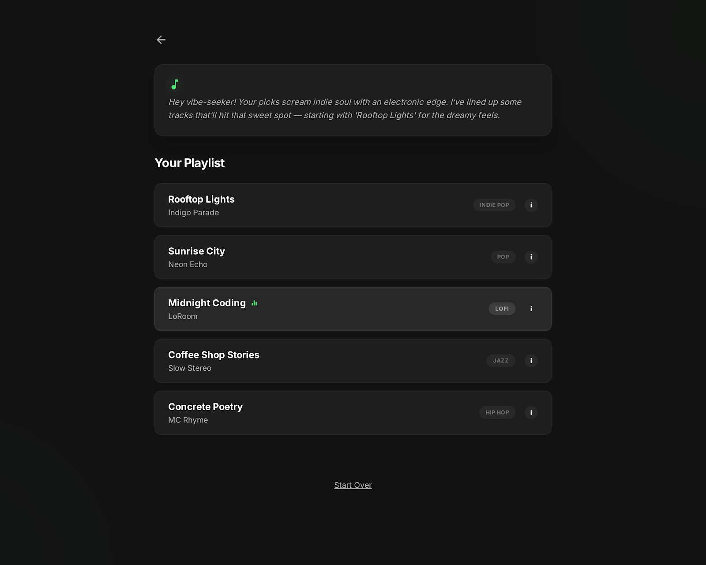

# VibeFinder UI/UX Design System & Mockup Catalog

This directory contains the original UI design specifications, interactive mockups, HTML prototypes, and screen renders for **VibeFinder 2.0**.

---

## 1. Directory Hierarchy & User Flow Architecture

The mockups are organized by **user journey flow stages**, covering both mobile and desktop viewports alongside state variations (initial, active/selected, pressed, detail modal).

```
assets/mockups/
├── README.md                          <- Master Visual Catalog & Design Tokens
├── 01-splash-screen/                  <- Step 0: Landing / Brand Entry Point
│   ├── mobile-default/                (HTML + PNG render for mobile hero)
│   ├── mobile-pressed/                (HTML + PNG render for CTA interaction state)
│   └── desktop-default/               (HTML + PNG render for desktop widescreen hero)
├── 02-artist-selection/               <- Step 1: User Onboarding & Taste Input
│   ├── mobile-initial/                (HTML + PNG render for unselected artist grid)
│   ├── mobile-selected/               (HTML + PNG render for active artist selection)
│   └── desktop-5-selected/            (HTML + PNG render for desktop widescreen grid)
└── 03-playlist-results/               <- Step 2: Gemini DJ Intro & Playlist Output
    ├── mobile-default/                (HTML + PNG render for mobile recommendations)
    ├── mobile-info-selected/           (HTML + PNG render for track explanation modal)
    └── desktop-default/               (HTML + PNG render for desktop recommendations)
```

---

## 2. Visual Catalog & Screen Reference

| Flow Stage | Viewport | State / Variant | Screen Preview | Source Code |
| :--- | :--- | :--- | :--- | :--- |
| **Splash Screen** | Mobile | Default / Hero |  | [code.html](01-splash-screen/mobile-default/code.html) |
| **Splash Screen** | Mobile | Pressed CTA State |  | [code.html](01-splash-screen/mobile-pressed/code.html) |
| **Splash Screen** | Desktop | Widescreen Hero |  | [code.html](01-splash-screen/desktop-default/code.html) |
| **Artist Selection** | Mobile | Initial (Unselected) |  | [code.html](02-artist-selection/mobile-initial/code.html) |
| **Artist Selection** | Mobile | Active Selection |  | [code.html](02-artist-selection/mobile-selected/code.html) |
| **Artist Selection** | Desktop | 5 Artists Selected |  | [code.html](02-artist-selection/desktop-5-selected/code.html) |
| **Playlist Results**| Mobile | Results & DJ Card |  | [code.html](03-playlist-results/mobile-default/code.html) |
| **Playlist Results**| Mobile | Track Info Modal |  | [code.html](03-playlist-results/mobile-info-selected/code.html) |
| **Playlist Results**| Desktop | Widescreen Results |  | [code.html](03-playlist-results/desktop-default/code.html) |

---

## 3. Design System Tokens & Style Guide

These mockups establish the core design language used across the React frontend (`frontend/src/index.css`).

### Color Palette

| Token Name | Hex Code | Purpose / Usage |
| :--- | :--- | :--- |
| `--bg-primary` | `#121212` | Deep matte black main container background |
| `--bg-surface` | `#1E1E1E` | Card surface & secondary container background |
| `--bg-surface-hover` | `#282828` | Interactive surface hover & disabled button state |
| `--accent-green` | `#1DB954` | Primary brand accent, active CTAs, badges |
| `--accent-green-bright` | `#53E076` | Glow highlights & active selection borders |
| `--text-primary` | `#FFFFFF` | Primary headings, track titles, key action labels |
| `--text-secondary` | `#B3B3B3` | Subtitles, artist names, metadata, secondary body |

### Typography & Geometry
- **Primary Font**: `Inter`, system-ui, sans-serif
- **Heading Weight**: `700` / `800` (Bold/ExtraBold with `-0.01em` letter spacing)
- **Border Radius**:
  - Cards & Modals: `24px` (`--radius-card`)
  - Pill Buttons & Badges: `9999px` (`--radius-pill`)
- **Glow & Shadow**: `0 4px 12px rgba(29, 185, 84, 0.3)` (`--cta-glow`)
